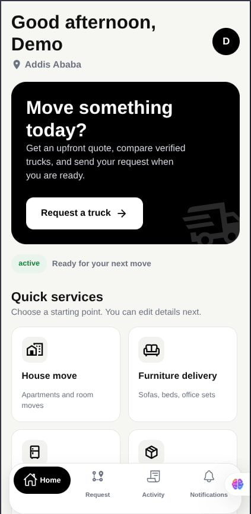
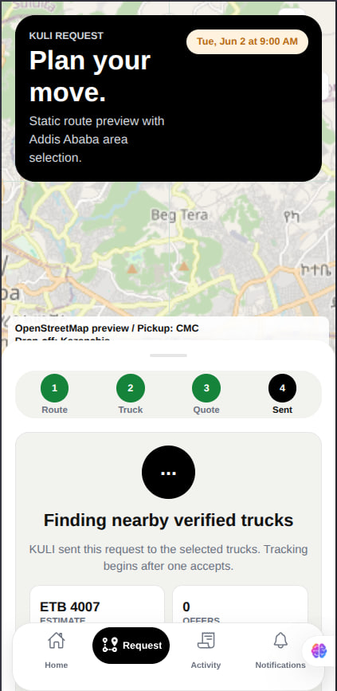
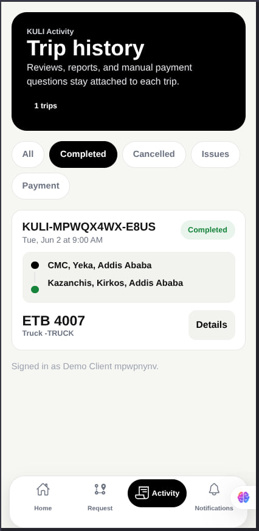
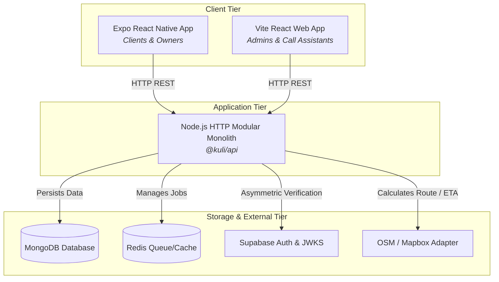
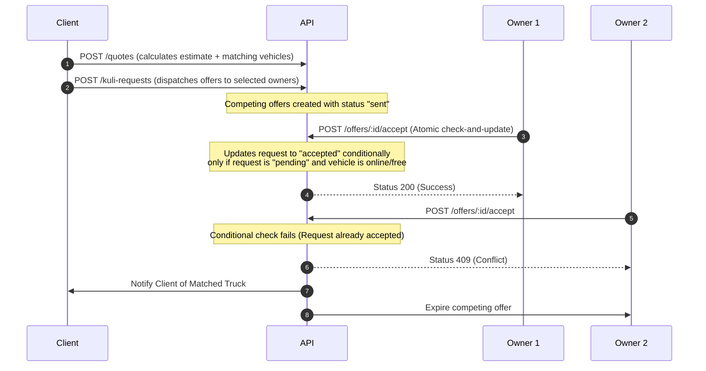

# KULI Logistics Platform

[](https://nodejs.org/)
[](https://expo.dev/)
[](https://react.dev/)
[](https://www.mongodb.com/)
[](https://supabase.com/)
[](https://www.typescriptlang.org/)

KULI is a high-performance, peer-to-peer trucking and logistics marketplace engineered specifically for operations in **Addis Ababa, Ethiopia**. The platform bridges the gap in the informal logistics sector by connecting clients who need transport for household moves, merchandise, or equipment with verified, independent truck owners and drivers. 

This repository houses the entire monorepo—containing the API, mobile application, admin panel, and shared domain packages—configured for streamlined development and production-grade deployment.

---

## 📱 Mobile App Previews

Here is a preview of the KULI mobile app running on React Native/Expo:

<p align="center">
  
  
  
</p>

---

## 🏛️ System Architecture

KULI is structured as a **Modular Monolith** to maintain low deployment complexity while preserving strict boundary lines for potential future service extraction.



### Monorepo Structure

```text
├── apps/
│   ├── api/            # Pure Node.js HTTP server utilizing modular domain controllers
│   ├── admin/          # React/Vite admin dashboard and call assistant console
│   └── mobile/         # React Native/Expo application targeting iOS, Android & Mobile Web
├── packages/
│   └── shared/         # Common TypeScript DTOs, validation schemas, and constants
├── tools/              # Verification, seeding, linting, and smoke testing utilities
└── docs/               # Detailed subsystem designs and roadmaps
```

---

## 👥 Platform Roles & Capabilities

The platform defines four first-class, server-enforced roles:

### 1. 👤 Client
*   **Discovery**: Create detailed logistics requests specifying pickup, destination, weight, load description, and scheduling.
*   **Quotes**: Request instant price calculations broken down by base fare, distance rate, and time estimates.
*   **Matching**: Discover nearby available, verified trucks with transparent pricing, reviews, and star ratings.
*   **Execution**: Track active trip statuses, chat with the matched driver, cancel trips inside the policy window, and submit star ratings and payment disputes.

### 2. 🚛 Truck Owner
*   **Onboarding**: Register trucks and upload required documents (Driver License, Ownership Proof, Registration, Insurance) into the verification queue.
*   **Availability**: Set status to `online` (only after admin verification) to become discoverable by geospatial queries.
*   **Matching**: Receive matching requests with live snapshots, accept or decline offers via a fast "first-accept-wins" queue, and navigate to pickups.
*   **Lifecycle**: Advance active trips manually (`en route`, `arrived`, `loading`, `in transit`, `completed`) and confirm cash payments.

### 3. ☎️ Call-Center Assistant
*   **Hotline Tickets**: Claim incoming missed calls or client support tickets from a unified helpdesk queue.
*   **Assisted Booking**: Look up clients by phone number, calculate quotes, choose suited truck owners, and book trips on behalf of clients.
*   **Lifecycle**: Monitor ticket workflows through `open`, `assigned`, `in_progress`, `pending_client`, and `closed` states.

### 4. 🔑 Administrator
*   **Approvals**: Manage user statuses and review pending vehicle/document verification queues with auditable reason logs.
*   **Operations**: Inspect live platform metrics, track active requests, audit system logs, and mediate payment disputes.
*   **Configuration**: Seed and manage global pricing rules (base fare, distance multiplier, vehicle class premiums).

---

## ⚡ Concurrency-Safe Booking Flow

To prevent multiple truck owners from accepting the same booking, the matching engine relies on atomic conditional updates during acceptance:



---

## 🚀 Quick Start Guide

### Prerequisites
*   **Node.js**: v20 or higher
*   **Docker**: For running MongoDB and Redis services locally
*   **Package Manager**: `npm` (configured with workspaces)

### 1. Start Local Infrastructure
Run MongoDB and Redis in the background using Docker Compose:
```bash
docker compose up -d
```
*MongoDB listens on `localhost:27018` and Redis listens on `localhost:6380`.*

### 2. Environment Variables Configuration
Copy example env files and update them with your credentials:
```bash
cp apps/api/.env.example apps/api/.env
cp apps/mobile/.env.example apps/mobile/.env
cp apps/admin/.env.example apps/admin/.env
```

### 3. Install Dependencies
```bash
npm install
```

### 4. Validate Monorepo Health
Run the static analysis check and verification scripts to confirm the setup:
```bash
# Lints the entire codebase
npm run lint

# Runs typechecking across all workspaces
npm run typecheck

# Runs unit and integration test suites
npm test

# Checks startup readiness of the API, mobile web export, and admin compilation
npm run verify:startup
```

### 5. Running Services Locally
Start the API, Admin console, and Mobile applications in development mode:

```bash
# Start API backend (runs on http://localhost:4000)
npm run dev:api

# Start Admin & Assistant dashboard (runs on http://localhost:5174)
npm run dev:admin

# Start Mobile app Metro packager (runs Expo Go)
npm run dev:mobile
```

---

## 🧪 Local Demo Mode & Seeding

KULI provides an offline development mode to let you explore all user journeys without configuring Supabase authentication or SMS/email providers.

### 1. Enable Demo Auth
Add the following flags to your local `.env` files:
```env
# apps/api/.env
DEMO_AUTH_ENABLED=true

# apps/mobile/.env
MOBILE_APP_DEMO_AUTH_ENABLED=true

# apps/admin/.env
ADMIN_APP_DEMO_AUTH_ENABLED=true
```

In this mode, login and registration screens bypass Supabase JWT issuance. You can log in as **Client**, **Truck Owner**, **Assistant**, or **Admin** with any email. The backend creates development bearer tokens formatted as:
```text
Authorization: Bearer dev:<supabaseUserId>
```

### 2. Seed Mock Database Data
Populate your local MongoDB with representative operational data, including pre-registered vehicles, active assistants, ticketing queues, and pricing configurations:
```bash
npm run seed:fake-users
```
*Note: Use `npm run reset:auth-data` to purge temporary demo accounts and re-initialize a clean, lightweight environment.*

---

## 🔒 Production Hardening & Security Policy

When moving from development to a staging or production target, verify the following policies are strictly enforced:

*   **Supabase JWT Verification**: Set `SUPABASE_JWT_MODE=supabase` in `apps/api/.env`. This enables asymmetric signature verification of client authorization headers against the remote Supabase JWKS endpoint (`SUPABASE_JWKS_URL`).
*   **Role Validation**: Roles are synced from MongoDB collections during token validation. The API **never** trusts role claims supplied inside client payloads.
*   **File Storage Validation**: Document uploads verify MIME types, file sizes, and binary headers before creating temporary pre-signed S3/Supabase storage links.
*   **CORS Configuration**: Restrict private-network routing controls (`CORS_ALLOW_PRIVATE_NETWORK`) and lock allowed origins to hosted endpoints.
*   **Audit Logging**: Every administrative action, verification decision, and pricing modification creates an immutable entry in the `auditlogs` collection.

---

## 🛠️ Verification & Pipeline Commands

Maintain project stability by running verification passes before pushing updates:

| Command | Workspace Target | Description |
|---|---|---|
| `npm run lint` | Root | Checks formatting, code style, and imports across all apps |
| `npm run typecheck` | Root | Compiles TypeScript configurations in strict mode |
| `npm test` | Root | Executes native Node.js tests (`node --test`) for API and contracts |
| `npm run smoke:critical` | Root | Verifies critical workflows: auth sync, booking creation, first-accept wins, and trip completion |
| `npm run verify:startup` | Root | Confirms local compilation and starts API connection test against MongoDB |


