# KULI Developer Guide

**Project:** KULI — P2P Logistics Mobile Application for On-Demand Trucking Service  
**Source:** `Final Project - Kuli(3).pdf`, Addis Ababa University Final Project I report, June 2026  
**Audience:** Developers, maintainers, testers, and AI coding agents working on the KULI codebase  
**Purpose:** Convert the long PDF into one practical engineering guide covering architecture, technical decisions, design decisions, domain rules, workflows, database design, security, testing, and implementation guardrails.

---

## 1. Product Summary for Developers

KULI is a peer-to-peer logistics marketplace for Addis Ababa. It connects clients who need truck-based transportation with verified independent truck owners. The first business focus is household relocation, but the system should also support furniture movement, appliance delivery, small business deliveries, and equipment transport.

The platform is not only a mobile marketplace. It also includes an admin dashboard and a call-assisted booking workflow so that users with limited digital literacy or no smartphone can still request trucking service through a call-center assistant.

### Core users

| Role | Main purpose | Main product surface |
|---|---|---|
| Client | Requests trucks, receives quotes, selects candidate vehicles, tracks status, messages owner, pays cash/manual, rates, reports issues | Mobile app |
| Truck Owner | Registers vehicle, uploads documents, receives offers, accepts/declines, updates trip status, confirms payment, manages availability | Mobile app |
| Call-Center Assistant | Creates or modifies requests on behalf of clients, manages hotline tickets, records operator activity | Web/dashboard, not public mobile registration |
| Administrator | Reviews users, verifies vehicles/documents, manages pricing rules, handles reports/disputes, monitors platform health | Web admin dashboard |

### Scope boundaries

**In v1 / current implementation focus**

- Client and truck-owner registration and login.
- Role-based dashboards.
- Vehicle registration, document upload metadata, and admin verification.
- Quote generation and proximity-based candidate discovery.
- KULI request creation and offer dispatch.
- First-accept-wins offer acceptance.
- Manual status-based trip tracking.
- In-app messaging tied to a request.
- Cash/manual payment confirmation.
- Ratings, reports, disputes, and admin mediation.
- Hotline/call-assisted booking workflow.
- In-app notifications.
- Admin dashboard for operational control.

**Explicitly not in v1 / future scope**

- Real moving GPS tracking and live truck animation.
- Real digital payment gateway processing.
- Pay-in-advance and pay-on-acceptance backend flows.
- Real external SMS/email/push provider delivery unless provider keys are configured.
- Automated OCR-based document verification.
- Advanced live toll/fuel pricing automation.
- Multi-city marketplace expansion.
- Machine-learning-based automation.

Developers must not build UI copy that implies future features already exist. For example, tracking screens should say status-based tracking or map preview, not live GPS tracking.

---

## 2. Technical Decision Record

This section is the engineering decision log extracted from the report and normalized into practical implementation rules.

| ID | Decision | Rationale | Developer rule |
|---|---|---|---|
| D-001 | Use a mobile-first P2P marketplace model | The existing market is informal, fragmented, broker-based, and has unclear pricing/trust | Build around client request creation, verified supply, matching, transparent quote, status, and trust records |
| D-002 | Initial launch city is Addis Ababa | The requirements, constraints, traffic, address quality, and stakeholders are Addis Ababa-centered | Default seed data, map examples, pricing assumptions, and copy should be Addis Ababa aware |
| D-003 | Use a layered modular monolith | Simpler deployment and testing than microservices while keeping internal module boundaries | Keep one deployable backend, but enforce domain packages and service boundaries |
| D-004 | Use React Native for mobile | One codebase for Android/iOS and Expo/web testing | Mobile app must be role-specific and usable on small screens |
| D-005 | Use React/Vite for admin dashboard | Admin/staff workflows need desktop/web operations and larger management views | Do not expose admin/assistant public registration in mobile |
| D-006 | Use Node.js backend | Fits REST/JSON API, modular service classes, Supabase token verification, MongoDB repositories | Put business rules in services, not directly in UI |
| D-007 | Use REST/JSON APIs for v1 | Simpler transactional backend and easier testing with Postman/integration tests | State-changing API calls must return confirmed server state before UI shows success |
| D-008 | Use MongoDB as primary persistence | Flexible document data and native geospatial indexing are important for vehicle discovery | Store all product domain data in MongoDB; do not split domain state between databases |
| D-009 | Use MongoDB geospatial indexes | Nearby available trucks must be found efficiently by pickup location | Use GeoJSON `Point` and a `2dsphere` index on vehicle current location |
| D-010 | Use Supabase Auth for identity | Offloads email/OTP/session/auth provider work | Supabase identifies the user; MongoDB stores KULI role/profile/account status |
| D-011 | Use RBAC and account-status guards | Four roles have different permissions and privacy boundaries | Every protected backend route must resolve auth, profile, account status, and role |
| D-012 | Verify truck owners before listing | Trust is one of the main user problems | Unverified vehicles must not appear in matching or receive offers |
| D-013 | Use configurable pricing rules | Fuel, truck class, load size, traffic, and market rates can change | Keep pricing rules in database and snapshot quote details on each request |
| D-014 | Store quote and vehicle-class snapshots | Historical trips must not change meaning when pricing/class definitions are edited later | Embed `quoteSnapshot` in requests and `vehicleClassSnapshot` in vehicles where needed |
| D-015 | Use manual status-based tracking in v1 | Real-time GPS is out of current scope | Use state transitions and event logs; never fake live GPS |
| D-016 | Use first-accept-wins offer handling | Multiple owners may receive the same request | Offer acceptance must be atomic and must close competing offers |
| D-017 | Use cash/manual payment confirmation in v1 | Ethiopia is cash-first and gateways are future scope | Record payment state; owner confirms after completion; block early payment |
| D-018 | Use request-scoped messaging | Messages should belong to the job context | Store messages by `requestId`; archive/collapse after terminal states |
| D-019 | Use call-assisted booking | Some users have limited digital literacy or no smartphone access | Assistant-created requests must store operator/assistant ID and ticket history |
| D-020 | Use audit logs and notifications as cross-cutting utilities | Trust, admin actions, and dispute history need traceability | Log sensitive/admin operations and create in-app notifications for important events |
| D-021 | Use risk-based testing | Money, roles, vehicle availability, and status changes are high risk | Test high-risk workflows more heavily than display-only screens |
| D-022 | No fake success states | The test plan makes backend confirmation mandatory | UI may show loading/optimistic pending, but final success only after API confirmation |

---

## 3. Important PDF Inconsistencies Resolved for Development

The PDF contains a few places where requirements, design, and implementation wording do not fully align. Use these resolutions to avoid team confusion.

| Issue | What appears in the PDF | Developer resolution |
|---|---|---|
| MongoDB access layer | Design mentions Mongoose ODM; implementation mentions repository classes using the native MongoDB driver | Standardize on **repository pattern** as the required architecture. Use either Mongoose or native driver consistently, but do not mix direct DB access inside services. If the current repo already uses native driver repositories, continue that. |
| Tracking scope | Requirements/design mention real-time tracking in some places, but scope and tests say real GPS is not v1 | v1 is **manual status tracking + static map preview**. WebSockets/live GPS are future integrations only. |
| Payment scope | Functional requirements mention pay-on-acceptance, pay-on-delivery, pay-in-advance; test plan says only cash/manual is current | v1 implements **pay-on-delivery cash/manual record**. Other payment flows must be disabled or marked future. |
| Truck owner dashboard numbering | Truck Owner Dashboard bullets are labeled FR-7.x even though FR-7 already means communication/notifications | Treat Truck Owner Dashboard as FR-10. Keep requirement IDs clean in code/test docs. |
| Trip status transition snippet | Code snippet omits a transition from `arrived_at_pickup` to `loading`, while diagrams/tests include arrival and loading | Canonical status map must include `arrived_at_pickup -> loading`. |
| Cloud hosting names | Deployment diagram says AWS/Heroku generically | Keep backend cloud-agnostic. Render, AWS, Heroku, Railway, or similar can host as long as HTTPS, env secrets, MongoDB, and Supabase integration are correct. |

---

## 4. Architecture Overview

### 4.1 Chosen architecture

KULI uses a **Layered Modular Monolith**.

It has three major tiers:

1. **Client Tier**
   - React Native mobile app for Clients and Truck Owners.
   - React/Vite web dashboard for Admins and Assistants.

2. **Application Tier**
   - Node.js backend.
   - REST/JSON API.
   - Modular domain services.
   - Authentication verification against Supabase.
   - RBAC, validation, business rules, and audit logging.

3. **Data Tier**
   - MongoDB as primary database.
   - Geospatial indexes for vehicle discovery.
   - File/document metadata records.
   - External file/archive storage can be added for real uploaded documents.

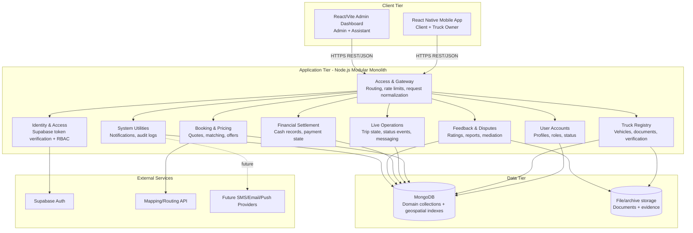

### 4.2 Why modular monolith instead of microservices

Use a modular monolith because the project is a university/final-year product with a small team and a v1 feature set. Microservices would add orchestration, service discovery, network latency, distributed transactions, and DevOps overhead too early.

The backend should still behave like it has internal services:

- No random cross-module imports.
- No UI code making business decisions.
- No services directly mutating collections owned by another module unless through a repository/service contract.
- Shared enums/contracts should live in shared modules.
- A module can later be extracted into a microservice if it becomes a bottleneck.

---

## 5. Recommended Monorepo Structure

The PDF says the delivered implementation is a modular monorepo containing a Node.js backend API, React Native mobile app, and React/Vite admin dashboard. Use a structure similar to this:

```text
kuli/
  apps/
    api/                  # Node.js backend API
    mobile/               # React Native / Expo app
    admin/                # React/Vite admin dashboard
  packages/
    shared/               # shared types, enums, validation constants
    api-client/           # typed API client used by mobile/admin
    config/               # shared lint/tsconfig/build config if needed
  docs/
    KULI_DEVELOPER_GUIDE.md
    api.md
    testing.md
    deployment.md
  docker-compose.yml
  .env.example
  README.md
```

Backend internal structure should follow packages/subsystems:

```text
apps/api/src/
  edge/                   # routing, API gateway, request parsing, middleware
  identity/               # Supabase verification, auth context, role guards
  accounts/               # user profiles, roles, account status
  registry/               # vehicles, vehicle classes, documents, verification
  logistics/              # quotes, requests, offers, status events, matching
  engagement/             # payments, ratings, reports, disputes
  support/                # hotline tickets, assisted booking
  shared/                 # AppError, ids, enums, validation, utils
  infrastructure/         # MongoDB connection, repositories, maps provider, notifications
```

---

## 6. Subsystems and Package Mapping

### 6.1 Subsystems

| Subsystem | Short name | Responsibility |
|---|---:|---|
| Access & Gateway | AG | API entry point, routing, protocol normalization, rate limiting, middleware |
| Identity Provider / Identity & Access | ID / IAM | Auth token verification, OTP/session integration, RBAC enforcement |
| User Accounts | UA | Client/owner/admin/assistant profiles, role metadata, preferences, account status |
| Truck Registry | TR | Vehicle enrollment, document metadata, verification, availability |
| Booking & Pricing | BP | Request validation, quote calculation, proximity discovery, offer dispatch |
| Live Operations | LO | Active trip state machine, manual status events, request-scoped messaging |
| Financial Settlement / Payment Manager | PM | Cash/manual payment records, invoice-like records, settlement audit |
| Feedback & Disputes | FD | Ratings, reviews, reports, disputes, admin mediation |
| System Utilities | SU | Notifications, audit logs, common infrastructure |

### 6.2 Domain packages

| Package | Contains | Primary responsibility |
|---|---|---|
| `kuli.edge` | AG, ID/IAM | Entry security, auth, request routing |
| `kuli.accounts` | UA, TR | User profiles, truck owner data, fleet verification |
| `kuli.logistics` | BP, LO | Core marketplace: quote, matching, offer, trip execution |
| `kuli.engagement` | PM, FD | Post-trip billing/payment state, ratings, reports, disputes |
| `kuli.shared` | SU, common contracts | Notifications, logging, shared enums, common utilities |

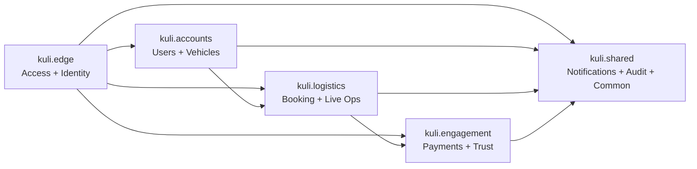

---

## 7. Role-Based Access Control

### 7.1 Role rules

| Operation | Admin | Client | Truck Owner | Assistant |
|---|:---:|:---:|:---:|:---:|
| Login/logout | Yes | Yes | Yes | Yes |
| Verify OTP/reset password | Yes | Yes | Yes | Yes |
| Update own profile | Yes | Yes | Yes | Yes |
| Suspend/ban/remove account | Yes | No | No | No |
| Register vehicle | No | No | Yes | No |
| Verify vehicle | Yes | No | No | No |
| Create KULI request | No | Yes | No | Yes |
| Cancel request | No | Yes | No | Yes, if acting on assisted request/policy allows |
| Accept request/offer | No | No | Yes | No |
| Update trip status | No | No | Yes | No |
| Send request-scoped message | No by default | Yes | Yes | Optional only if support context requires |
| Confirm payment | No | No | Yes | No |
| View transactions | Yes | Limited own records | Limited own records | No/limited support view |
| Submit rating | No | Yes | No | Yes when rating on behalf of caller is allowed |
| Resolve dispute | Yes | No | No | No |
| View audit logs | Yes | No | No | No |
| Configure notification preferences | Yes | Yes | Yes | Yes |

### 7.2 RBAC implementation rule

Every protected backend operation should follow this chain:

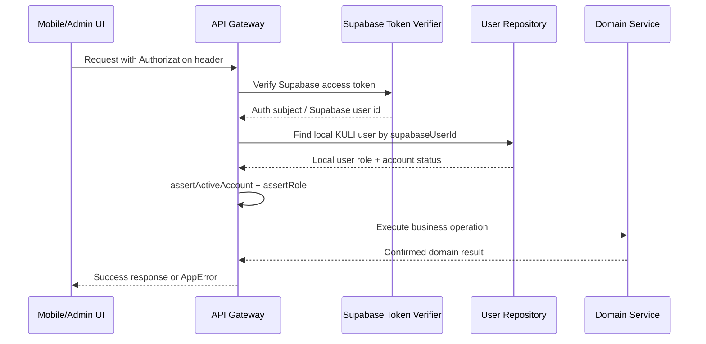

### 7.3 Staff registration rule

Admin and assistant accounts are staff roles. They must not appear as public registration options in the mobile app. Staff accounts should be created by seed scripts, admin invite flow, or controlled backend/admin process.

---

## 8. Authentication and Account Design

### 8.1 Supabase + MongoDB split

Supabase is the identity provider. MongoDB is the application profile and domain database.

| Data | System of record |
|---|---|
| Email/password auth, OTP, auth session, refresh token | Supabase Auth |
| KULI user role | MongoDB `users` |
| Account status: active/suspended/banned | MongoDB `users` |
| User preferences, profile, phone, local metadata | MongoDB `users` |
| Vehicle ownership, requests, trips, ratings, payments | MongoDB collections |

### 8.2 Login rule

Do not trust a frontend-selected role after login. After Supabase authentication, the backend must load the MongoDB user profile and route by backend role.

### 8.3 Account statuses

Recommended statuses:

```text
active
pending_verification
suspended
banned
deleted
```

Blocked/suspended/banned users must be rejected by backend guards, not only hidden from UI.

### 8.4 Indexes

```js
await users.createIndexes([
  { key: { supabaseUserId: 1 }, unique: true },
  { key: { email: 1 }, unique: true, sparse: true },
  { key: { phone: 1 }, unique: true, sparse: true }
]);
```

---

## 9. Core Domain Model

### 9.1 Primary entities

| Entity | Purpose | Important fields |
|---|---|---|
| User | All users in the platform | `id`, `supabaseUserId`, `role`, `name`, `email`, `phone`, `accountStatus`, `preferences`, timestamps |
| Vehicle | Truck owned by a truck owner | `id`, `ownerId`, `vehicleClassId`, `licensePlate`, `capacity`, `verificationStatus`, `availabilityStatus`, `currentLocation`, `activeTripId` |
| VehicleClass | Configurable truck category | `id`, `name`, `capacity`, `basePricing`, `isActive` |
| VehicleDocument | Document metadata for verification | `id`, `vehicleId`, `ownerId`, `type`, `fileId`, `status`, `reviewedBy`, `rejectionReason` |
| File | Uploaded file metadata | `id`, `entityType`, `entityId`, `filename`, `mimeType`, `storageKey`, `size`, timestamps |
| PricingRule | Versioned fare settings | `id`, `vehicleClassId`, `baseFare`, `distanceRate`, `durationRate`, `fuelSurcharge`, `loadAdjustment`, `isActive`, version |
| KuliRequest | Main logistics request/trip | `id`, `requestCode`, `clientId`, pickup/destination, load details, `status`, selected owner/vehicle, `quoteSnapshot` |
| TripOffer | Request-to-vehicle candidate offer | `id`, `requestId`, `ownerId`, `vehicleId`, `status`, distance/ETA at offer time, `expiresAt` |
| KuliStatusEvent | Trip timeline/audit event | `id`, `requestId`, `fromStatus`, `toStatus`, `actorId`, timestamp, notes |
| Message | Request-scoped chat | `id`, `requestId`, `senderId`, `body`, `attachments`, timestamps |
| Payment | Cash/manual payment record | `id`, `requestId`, `payerClientId`, `payeeOwnerId`, `flow`, `method`, `status`, amount |
| Rating | Service rating/review | `id`, `requestId`, `clientId`, `ownerId`, `rating`, `reviewText` |
| Report | Complaint/dispute | `id`, `reporterId`, `reportedUserId`, `requestId`, `category`, `description`, `evidenceFileIds`, `status`, `resolution` |
| Notification | In-app alert record | `id`, `recipientUserId`, `type`, `title`, `body`, `data`, `channels`, `deliveryStatus`, `readAt` |
| HotlineTicket | Assisted booking/support workflow | `id`, `ticketCode`, `callerPhone`, `assignedAssistantId`, `status`, `requestId`, history |
| AuditLog | Sensitive/admin action log | `id`, `actorId`, `action`, `entityType`, `entityId`, `metadata`, timestamp |

### 9.2 Collection list

The implementation should use these collections:

```text
users
vehicles
vehicle_classes
vehicle_documents
files
pricing_rules
kuli_requests
trip_offers
kuli_status_events
messages
payments
ratings
reports
notifications
device_tokens
notification_intents
hotline_tickets
audit_logs
```

### 9.3 Relationship model

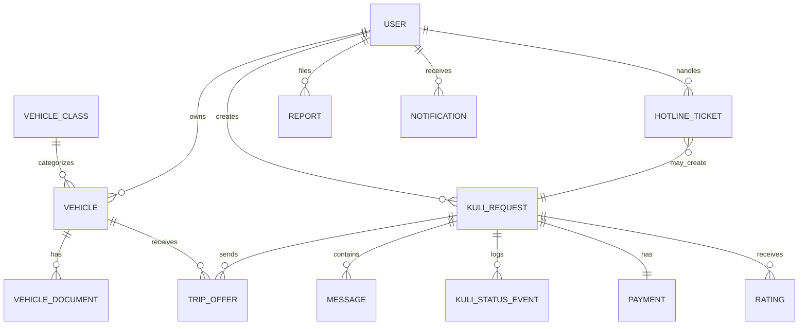

### 9.4 Reference vs embedded snapshot rule

Use references for entities that change independently:

- `clientId`
- `ownerId`
- `vehicleId`
- `requestId`
- `acceptedOfferId`
- `reportedUserId`
- `assignedAssistantId`

Use embedded snapshots for historical consistency:

- `quoteSnapshot` inside `kuli_requests`.
- `vehicleClassSnapshot` inside `vehicles` or `kuli_requests` when the historical vehicle class/pricing matters.
- Offer distance/ETA at the time the offer was created.

This prevents later pricing-rule or vehicle-class edits from changing the meaning of an old trip.

---

## 10. Database Indexes and Data Integrity

### 10.1 Vehicle indexes

```js
await vehicles.createIndexes([
  {
    key: { 'currentLocation.point': '2dsphere' },
    name: 'vehicles_current_location_2dsphere',
    sparse: true
  },
  {
    key: { licensePlate: 1 },
    unique: true,
    name: 'vehicles_license_plate_unique'
  },
  {
    key: { ownerId: 1, verificationStatus: 1, availabilityStatus: 1 },
    name: 'vehicles_owner_verification_availability'
  }
]);
```

### 10.2 Offer indexes

```js
await tripOffers.createIndexes([
  {
    key: { requestId: 1, vehicleId: 1 },
    unique: true,
    name: 'trip_offers_request_vehicle_unique'
  },
  {
    key: { ownerId: 1, status: 1, expiresAt: 1 },
    name: 'trip_offers_owner_status_expiry'
  }
]);
```

### 10.3 Payment index

```js
await payments.createIndexes([
  {
    key: { requestId: 1 },
    unique: true,
    name: 'payments_request_unique'
  }
]);
```

### 10.4 Hotline ticket indexes

```js
await hotlineTickets.createIndexes([
  { key: { ticketCode: 1 }, unique: true },
  { key: { assignedAssistantId: 1, status: 1 } },
  { key: { callerPhone: 1, createdAt: -1 } }
]);
```

### 10.5 Data integrity rules

- License plate must be unique.
- One payment record per completed request.
- One offer per request/vehicle pair.
- A vehicle cannot go online unless approved.
- An unverified/offline/busy/suspended vehicle cannot receive offers.
- A request cannot be accepted by more than one vehicle.
- A status transition must follow the state machine.
- A rating must be an integer from 1 to 5.
- A user must not access or mutate records outside their role/ownership rules.

---

## 11. Location and Geospatial Design

### 11.1 GeoJSON standard

Store pickup, destination, and current vehicle location as GeoJSON `Point` values.

```json
{
  "address": "Bole, Addis Ababa",
  "point": {
    "type": "Point",
    "coordinates": [38.7900, 9.0100]
  }
}
```

MongoDB GeoJSON order is:

```text
[longitude, latitude]
```

Do not reverse latitude and longitude.

### 11.2 User experience rules

- GPS can be used when available.
- Manual location entry/pin adjustment must be supported because Addis Ababa addresses can be ambiguous.
- Client must confirm pickup and destination text before dispatch.
- Call assistants should verify unclear locations by phone.
- Map preview is allowed in v1; real moving location is future.

---

## 12. Pricing and Quote Design

### 12.1 Pricing inputs

A quote should consider:

- Vehicle class/truck type.
- Pickup location and destination.
- Distance.
- Estimated duration/ETA.
- Load weight and/or volume.
- Capacity fit.
- Optional loading assistance or special handling.
- Fuel surcharge or market-adjustable cost component.
- Tolls or extra charges when available.
- Optional client tip/incentive amount.

### 12.2 Quote snapshot

Every created request must store a `quoteSnapshot` containing the exact pricing inputs and outputs used at the time of request creation.

Recommended snapshot:

```json
{
  "pricingRuleId": "rule_...",
  "pricingRuleVersion": 3,
  "vehicleClassId": "vclass_medium",
  "vehicleClassName": "Medium Truck",
  "distanceKm": 12.4,
  "estimatedDurationMin": 38,
  "baseFare": 0,
  "distanceCharge": 0,
  "durationCharge": 0,
  "loadAdjustment": 0,
  "fuelSurcharge": 0,
  "optionalServicesCharge": 0,
  "tipAmount": 0,
  "currency": "ETB",
  "total": 0,
  "calculatedAt": "ISO_DATE"
}
```

Use real values in code; never show placeholder pricing as confirmed output.

### 12.3 Candidate ranking

The PDF implementation mentions a ranking concept using distance, rating, completion rate, and dispute penalty:

```js
const rankingScore = Number((
  distanceKm * 10 - rating * 3 - completionRate * 2 + disputePenalty
).toFixed(2));
```

Treat this as a simple initial scoring heuristic. If used, document that a **lower score is better** because distance and dispute penalty increase the score while rating/completion reduce it.

Recommended matching filters before ranking:

1. Vehicle is approved.
2. Vehicle is online/available.
3. Vehicle is not busy and has no active trip.
4. Vehicle capacity satisfies requested load.
5. Vehicle is within the configured search radius.
6. Owner account is active.
7. Vehicle/owner is not suspended or blocked due to disputes.

Recommended ranking factors:

| Factor | Effect |
|---|---|
| Shorter distance to pickup | Better |
| Better aggregate rating | Better |
| Better completion rate | Better |
| Fewer unresolved/frequent disputes | Better |
| Suitable truck capacity | Required filter, not only ranking |
| Availability | Required filter |

---

## 13. Main Workflows

### 13.1 Registration and login

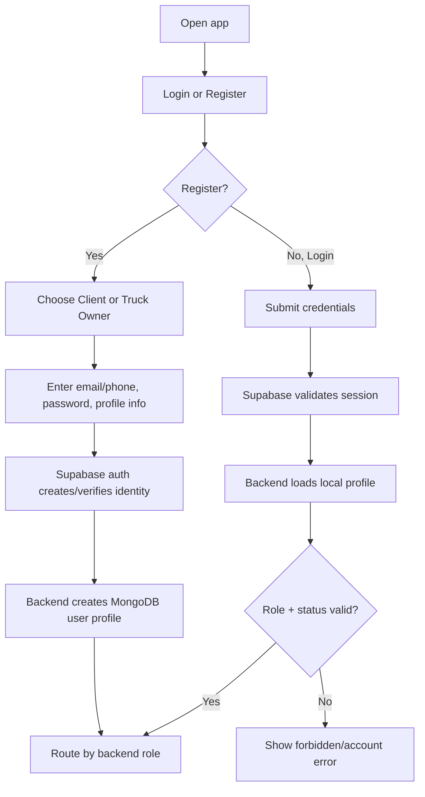

Developer rules:

- Registration is public only for Client and Truck Owner.
- Role routing must use backend profile role, not UI-selected role.
- Login failure must be recoverable with clear error message.
- Session persistence must survive app refresh when token is valid.
- Password reset/account recovery should go through Supabase email/OTP flow.

### 13.2 Truck owner vehicle onboarding

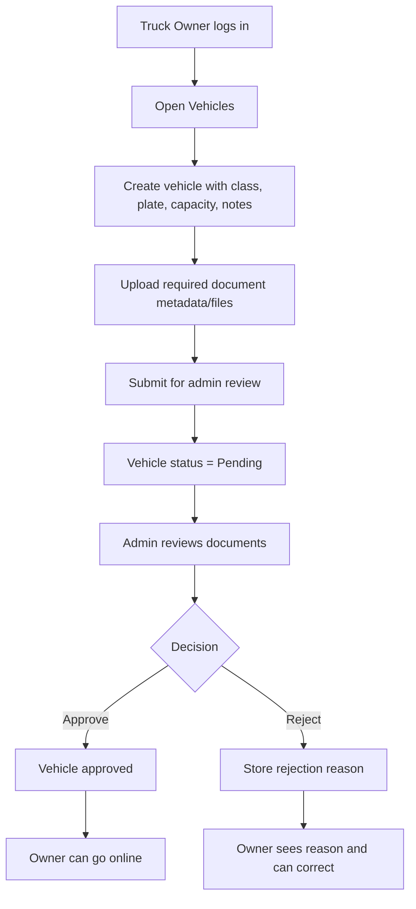

Developer rules:

- Required documents should be visible to owner.
- Pending/rejected vehicles cannot go online.
- Rejection reason must be visible.
- Admin decision must be timestamped and linked to admin user.
- Uploaded files must be checked for corrupted/unintelligible files where possible.
- Never expose raw private document URLs to unauthorized users.

### 13.3 Client KULI request creation

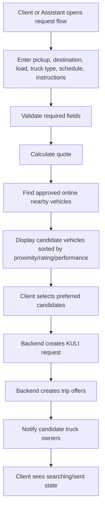

Developer rules:

- Same pickup/drop-off should be blocked.
- Negative or missing load values should be blocked.
- Request/offers must be created only after backend confirmation.
- Empty discovery must show a helpful empty state, not a crash.
- Candidate selection must be required before sending where the flow expects selected candidates.

### 13.4 Offer handling and first-accept-wins

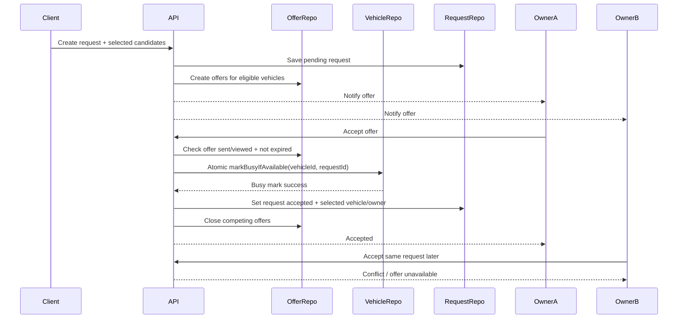

Developer rules:

- Accept operation must check offer ownership.
- Accept operation must check offer status and expiry.
- Accept operation must check vehicle availability.
- Use conditional update or database transaction to avoid two owners winning.
- Competing offers must be closed after acceptance.
- Owner B must receive a clear conflict/unavailable message, not a generic failure.

### 13.5 Trip status workflow

Canonical backend statuses:

```text
pending/searching
accepted
en_route_to_pickup
arrived_at_pickup
loading
in_transit
unloading
completed
cancelled
timed_out
```

Optional alias mapping:

| UI label | Backend status |
|---|---|
| Requested / Searching | `pending` |
| Matched / Accepted | `accepted` depending on exact workflow stage |
| En route | `en_route_to_pickup` |
| Arrived | `arrived_at_pickup` |
| Loading | `loading` |
| In transit | `in_transit` |
| Unloading | `unloading` |
| Completed | `completed` |
| Cancelled | `cancelled` |
| Timed out | `timed_out` |

Recommended transition map:

```js
const statusTransitions = {
  pending: ['accepted', 'cancelled', 'timed_out'],
  accepted: ['en_route_to_pickup', 'cancelled'],
  en_route_to_pickup: ['arrived_at_pickup', 'cancelled'],
  arrived_at_pickup: ['loading', 'cancelled'],
  loading: ['in_transit', 'cancelled'],
  in_transit: ['unloading', 'cancelled'],
  unloading: ['completed', 'cancelled'],
  completed: [],
  cancelled: [],
  timed_out: []
};
```

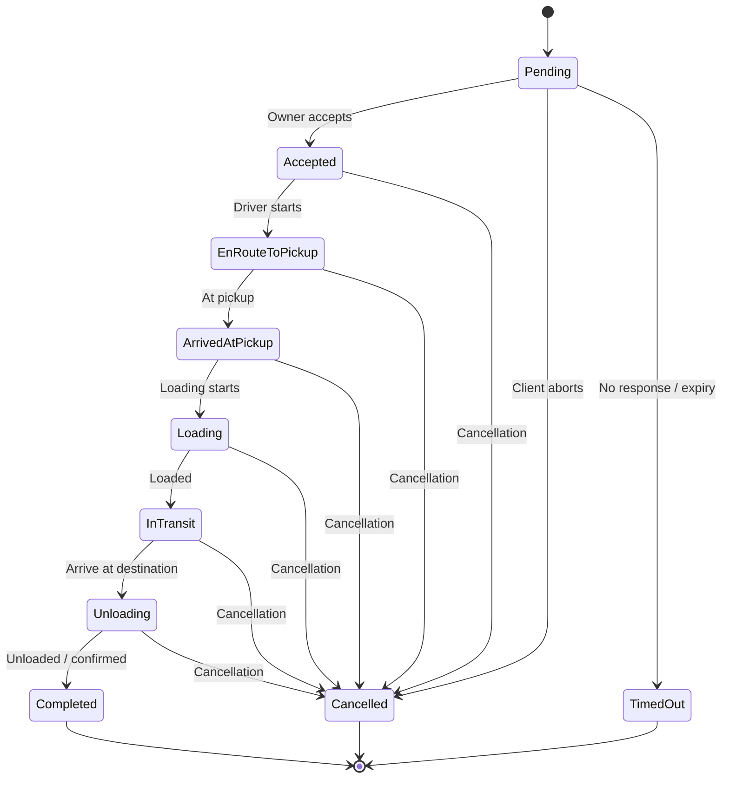

Developer rules:

- Every status update must create a `kuli_status_events` record.
- Only truck owners assigned to the active trip can update trip status.
- Client can view timeline but cannot arbitrarily update owner-controlled trip states.
- Cancellation rules must be configurable and enforced by backend.
- Terminal states should prevent further chat/status changes except support/report flows.

### 13.6 Vehicle availability state machine

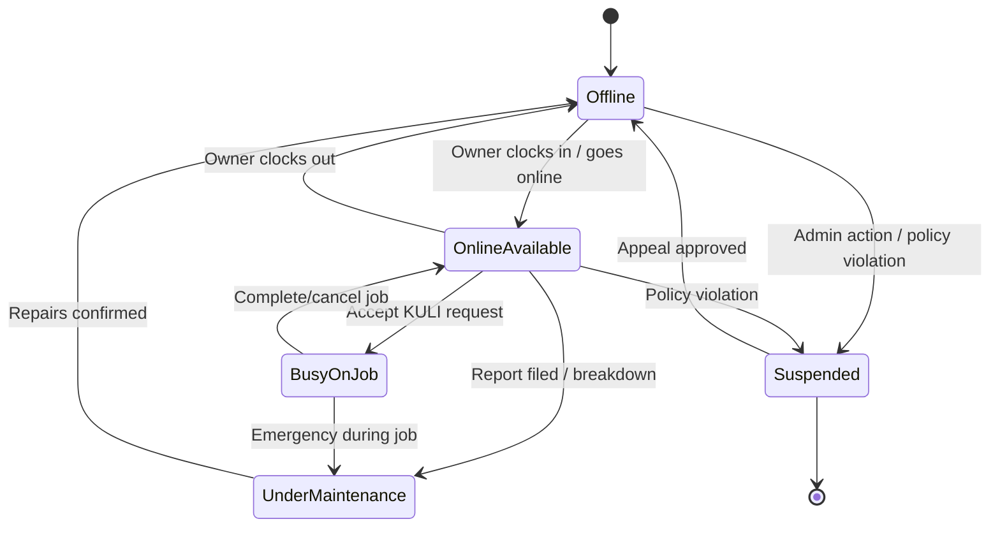

Developer rules:

- Only approved vehicles can move from offline to online.
- Busy vehicles must not appear in discovery.
- Suspended vehicles must not receive offers.
- Maintenance state must block availability.

### 13.7 Hotline / assisted booking ticket flow

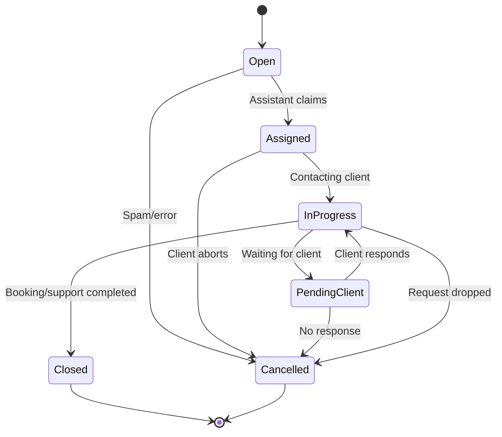

Developer rules:

- Assistant ID must be recorded.
- Ticket history must include status changes and timestamps.
- Assisted KULI request must link to client and assistant/operator.
- Closed ticket cannot be edited except by admin override/audit-controlled action.
- No-response and spam/error outcomes should be separate from successful closure.

---

## 14. Payment Design

### 14.1 v1 payment rule

KULI v1 records **manual cash payment confirmation**, mainly pay-on-delivery.

Do not present this as real gateway payment. Recommended UI labels:

- `Cash payment pending confirmation`
- `Cash confirmed by owner`
- `Payment disputed`
- `Manual payment record`

Avoid labels like:

- `Paid online`
- `Card charged`
- `Wallet transfer complete`

### 14.2 Payment lifecycle

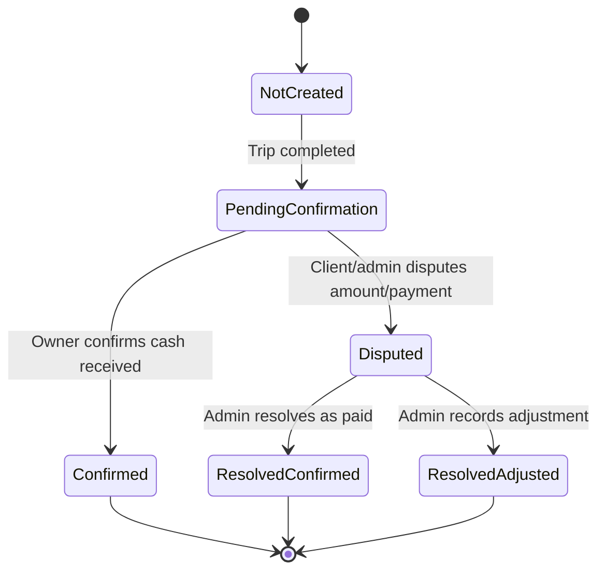

### 14.3 Payment rules

- Create payment record when trip reaches completed state.
- Only selected truck owner can confirm cash receipt.
- Payment confirmation before trip completion must be blocked.
- Client must see payment status in human-readable language.
- Dispute must create/update report/dispute state and notify admin/support.
- One payment record per request.

---

## 15. Ratings, Reports, and Trust Design

### 15.1 Rating rules

- Client can rate after completed trip.
- The PDF also allows rating terminated/cancelled KULI; if enabled, distinguish completed-service rating from cancellation feedback.
- Rating must be integer `1..5`.
- Duplicate rating must be blocked or handled idempotently.
- Owner aggregate rating must be recalculated after valid rating.
- Aggregate rating feeds matching/ranking.

### 15.2 Report/dispute rules

Reports may be filed by Client or Assistant, reviewed by Admin.

Report should include:

```text
reporterId
reportedUserId / truckOwnerId
requestId
category
description
evidenceFileIds[]
status
resolution
reviewedBy
resolutionDate
```

Admin actions should be audit-logged and may affect owner visibility through dispute penalty or suspension.

---

## 16. Notifications Design

### 16.1 v1 notification channels

Primary v1 channel:

- In-app notifications stored in MongoDB.

Future/optional channels:

- SMS.
- Email.
- Push notifications.

External delivery is only testable when provider keys are configured. Until then, store notification intents and in-app records.

### 16.2 Notification events

Create notifications for:

- Request submission.
- Offer received.
- Offer accepted.
- Driver en route.
- Arrival / loading / in-transit / unloading / completed.
- Cancellation.
- Payment pending/confirmed/disputed.
- Vehicle verification approved/rejected.
- Report/dispute updates.
- Message received.

Recommended notification object:

```js
const createNotification = ({ recipientUserId, type, title, body, data }) => ({
  id: createId('notif'),
  recipientUserId,
  type,
  title,
  body,
  data,
  channels: ['in_app'],
  deliveryStatus: 'pending'
});
```

---

## 17. API Design Guidelines

The PDF shows `/api/v1/kuli-requests` as an example. Keep all APIs versioned.

Recommended API groups:

```text
/api/v1/auth/profile
/api/v1/users/me
/api/v1/vehicles
/api/v1/vehicle-classes
/api/v1/vehicle-documents
/api/v1/quotes
/api/v1/kuli-requests
/api/v1/trip-offers
/api/v1/kuli-requests/:id/status
/api/v1/kuli-requests/:id/messages
/api/v1/payments
/api/v1/ratings
/api/v1/reports
/api/v1/notifications
/api/v1/hotline-tickets
/api/v1/admin/users
/api/v1/admin/vehicles/verification
/api/v1/admin/pricing-rules
/api/v1/admin/reports
/api/v1/admin/system-health
```

### 17.1 Route handler pattern

Every state-changing route should:

1. Resolve auth.
2. Assert active account.
3. Assert role.
4. Parse JSON body.
5. Validate input.
6. Call service method.
7. Return service result.
8. Convert known failures to `AppError` responses.

Example pattern:

```js
if (method === 'POST' && path === '/api/v1/kuli-requests') {
  const { currentUser } = await resolveAuth();
  assertActiveAccount(currentUser);
  assertRole(currentUser, [roles.client]);

  return success(await context.marketplaceService.createRequest({
    actor: currentUser,
    input: await parseJsonBody(request),
    idempotencyKey: request.headers['idempotency-key']
  }), 201);
}
```

### 17.2 Idempotency

Use idempotency keys for important create/accept operations:

- Request creation.
- Offer acceptance.
- Payment confirmation.
- Rating submission.
- Report creation.

This protects users from duplicate actions when network retries happen.

---

## 18. Error Handling Standards

Use a controlled error class for expected failures.

```js
export class AppError extends Error {
  constructor(statusCode, code, message, details = undefined) {
    super(message);
    this.statusCode = statusCode;
    this.code = code;
    this.details = details;
  }
}
```

Recommended error response shape:

```json
{
  "error": {
    "code": "OFFER_NOT_AVAILABLE",
    "message": "This offer is no longer available.",
    "details": {}
  }
}
```

### 18.1 Common error codes

| Code | HTTP | Use case |
|---|---:|---|
| `UNAUTHENTICATED` | 401 | Missing/invalid auth token |
| `FORBIDDEN` | 403 | Role not allowed |
| `ACCOUNT_BLOCKED` | 403 | Suspended/banned account |
| `VALIDATION_ERROR` | 422 | Invalid input values |
| `LOCATION_REQUIRED` | 400/422 | Missing/invalid GeoJSON location |
| `VEHICLE_NOT_APPROVED` | 409 | Owner tries to go online or accept with unapproved vehicle |
| `OFFER_NOT_AVAILABLE` | 409 | Offer expired/closed/already accepted |
| `INVALID_STATUS_TRANSITION` | 409 | Trip status jump is not allowed |
| `PAYMENT_NOT_ELIGIBLE` | 409 | Payment confirmation before completion |
| `DUPLICATE_RESOURCE` | 409 | Unique plate/payment/offer duplicate |
| `NOT_FOUND` | 404 | Entity not found or not visible to actor |

### 18.2 UI error rule

Errors must be user-visible and recoverable. Do not silently fail. Do not show success if the backend returned an error.

---

## 19. Security Decisions

### 19.1 Required security controls

- HTTPS/TLS for all client-to-backend traffic.
- Supabase Auth token verification for protected APIs.
- RBAC on backend routes and service operations.
- Account-status guard for suspended/banned users.
- Sensitive admin actions recorded in audit logs.
- Passwords never stored in MongoDB by KULI backend.
- No secrets committed to Git.
- `.env.example` may show variable names, not real secret values.
- File/document access must be authorized.
- Admin/assistant staff workflows must not be exposed as public mobile registration.

### 19.2 Secrets and key management

Use environment variables locally and a cloud secret manager in production. Rotate keys if exposed.

Minimum environment groups:

```text
NODE_ENV
PORT
MONGODB_URI
SUPABASE_URL
SUPABASE_PUBLISHABLE_KEY       # safe for public clients when RLS is enabled
SUPABASE_JWKS_URL              # Supabase Auth JWT verification
SUPABASE_SECRET_KEY            # optional backend-only key; never expose to mobile/web clients
MAPS_API_KEY
FILE_STORAGE settings
NOTIFICATION provider settings (future)
```

### 19.3 Audit events

Audit log should record:

- Admin user suspend/ban/verify actions.
- Vehicle approval/rejection.
- Pricing rule changes.
- Report/dispute resolution.
- Payment dispute resolution.
- Staff account creation/role changes.
- Sensitive file/document access where practical.

---

## 20. UI/UX Design Decisions

### 20.1 General UI principles

- Mobile-first.
- Role-specific screens only.
- Simple, clear flows for users with limited digital literacy.
- Map-first request/tracking experience where useful.
- No debug labels or route names in production UI.
- No hidden failure states.
- Loading, empty, offline, and error states must be designed intentionally.
- Support small phone screens down to about 4.7 inches / 360x640 viewport.
- Local language support is future, but copy should be easy to translate.

### 20.2 Client mobile tabs

Recommended client tabs from the test plan:

```text
Home
Request
Activity
Notifications
```

Client core screens:

- Auth / login / register / reset password.
- Home active move summary.
- Request truck flow.
- Quote breakdown.
- Candidate vehicle selection.
- Active tracking/status timeline.
- Request-scoped messages.
- Activity/history.
- Rating/report/payment state.
- Notifications and preferences.

### 20.3 Truck owner mobile tabs

Recommended owner tabs from the test plan:

```text
Home
Vehicles
Offers
Notifications
Earnings
```

Owner core screens:

- Owner dashboard.
- Vehicle registration/editing.
- Required document upload state.
- Verification result and rejection reason.
- Availability toggle.
- Offer inbox.
- Active trip and status update controls.
- Payment confirmation.
- Earnings/history.
- Ratings summary.

### 20.4 Admin dashboard

Admin dashboard should support:

- User management.
- Vehicle verification queue.
- Document review and approval/rejection.
- Pricing rules / capacity bands.
- Requests/trip oversight.
- Reports and disputes.
- Payment oversight.
- Support/hotline ticket management.
- Notifications/system health/audit where available.

### 20.5 Assistant dashboard

Assistant dashboard should support:

- Hotline ticket queue.
- Claim ticket.
- Caller/client details.
- Assisted booking form.
- Search/quote/candidate selection on behalf of client.
- Ticket status transitions.
- Notes/history.
- Escalation to admin.

---

## 21. Business Rules and Constraints

### 21.1 Business rules

- A client may have up to one active pickup request per shipment; concurrent request policy should be configurable by admin.
- Only verified truck owners/vehicles are eligible to receive or accept requests.
- Cancellation windows, fees, and penalties should be configurable.
- A vehicle must be approved before going online.
- A busy vehicle cannot accept another active trip.
- A request should not be completed without valid prior transitions.
- Payment confirmation is allowed only after completion.
- Ratings are allowed only for eligible terminated/completed trips.
- Reports/disputes must be traceable and admin-resolvable.

### 21.2 Real-world constraints and system mitigations

| Constraint | Impact | Developer/product mitigation |
|---|---|---|
| Limited truck availability | Long waits and unmet requests at peak times | Waitlists, wider search radius, fleet partnerships, clear empty states |
| Verification delays | Few available owners during launch | Manual review dashboard, prioritized queue, clear pending/rejected states |
| Limited insurance coverage | Legal/financial risk for damaged goods | Require vehicle insurance where available, disclaim goods coverage, optional future cargo insurance |
| Cash-first economy | Harder commission collection and disputes | Manual payment records, reconciliation, clear payment status, future digital incentives |
| Network/device limitations | Reliability issues for users with older phones | Lightweight UI, retry/offline forms, clear offline state, avoid heavy animations |
| Poor/nonstandard addressing | Failed pickups or confusion | Manual pin adjustment, address confirmation, call-assisted verification |
| Fraud/data quality risk | Fake profiles, manipulated ratings, inaccurate listings | Verification, audit logs, anomaly checks, dispute penalties |
| Call-center capacity | Bottleneck for non-digital users | Ticket queue, templated flows, assistant workload dashboard |
| Traffic/road conditions | Unpredictable ETAs and cost | Conservative ETA, route notes, driver adjustment, congestion warning |
| Fuel price volatility | Estimates become inaccurate | Configurable pricing rules, fuel surcharge, periodic fare review |

---

## 22. Testing Strategy

### 22.1 Testing approach

KULI uses a layered, risk-based testing strategy:

| Layer | Purpose |
|---|---|
| Unit/business-rule tests | Validate pricing, validation, RBAC, status transitions, matching filters |
| Integration/API tests | Validate auth/profile sync, vehicle verification, quotes, requests, offers, payments |
| Mobile UI/manual tests | Validate request flow, owner flow, tracking, messages, error states |
| Admin dashboard tests | Validate verification, reports, pricing, support operations |
| Regression tests | Re-run impacted workflows after code changes |
| Acceptance/end-to-end tests | Validate complete user workflows across roles |

### 22.2 Test tools

Use:

- Node.js test runner / `npm test`.
- TypeScript compiler / `npm run typecheck`.
- Lint scripts / `npm run lint`.
- Jest where used by the project.
- Postman or API client for manual API checks.
- React Native Testing Library for mobile component tests where practical.
- Expo CLI / Expo Go / browser preview.
- Android emulator or physical devices for mobile validation.
- Docker Compose for local MongoDB/Redis.
- Supabase Dashboard for auth/email/reset/session checks.
- Browser DevTools for admin/mobile web debugging.

### 22.3 High-risk features to test heavily

- Authentication and registration.
- Password reset/account recovery.
- Role-based routing.
- Client request creation.
- Quote calculation.
- Nearby truck/candidate discovery.
- Request dispatch and offer creation.
- Vehicle registration and document verification.
- Owner availability.
- Offer inbox.
- Accept/decline offer.
- First-accept-wins conflict handling.
- Trip status updates.
- Client tracking/status timeline.
- Messaging.
- Cancellation.
- Rating/review.
- Report/dispute.
- Manual cash payment confirmation.
- Notifications/preferences.
- Loading/empty/error/offline states.
- Mobile UI/UX responsiveness.

### 22.4 Features not tested in v1

- Live GPS tracking.
- Real-time moving truck animation.
- Real digital payment gateway.
- Pay-in-advance or pay-on-acceptance.
- Real SMS/email/push delivery without configured providers.
- Advanced toll/live fuel pricing.
- Automated OCR verification.
- Multi-city marketplace expansion.

### 22.5 Pass/fail criteria

A test passes only when:

- Actual output matches expected output.
- Backend confirms state-changing action before UI success.
- UI does not fake success.
- Errors are visible and recoverable.
- RBAC/security restrictions are enforced on backend.
- Data persists after refresh/re-login where expected.
- UI is usable, labels fit, and controls are accessible.

A test fails when:

- Actual output differs from expected output.
- UI shows success without backend confirmation.
- Unauthorized user can access restricted functionality.
- Data disappears or duplicates unexpectedly.
- User cannot recover from validation/network errors.
- UI contains route/debug labels or inaccessible controls.

### 22.6 Acceptance scenarios to keep in regression

Minimum regression suite:

1. Client registration and login.
2. Truck owner registration and login.
3. Admin/assistant blocked from mobile workspace.
4. Owner submits vehicle and documents.
5. Admin approves vehicle.
6. Approved owner goes online.
7. Client creates quote and request.
8. Candidate owner receives offer.
9. Owner accepts offer.
10. Competing owner gets unavailable/conflict result.
11. Owner progresses trip through valid statuses.
12. Invalid status jump is blocked.
13. Client sees active tracking timeline and messages.
14. Client cancels eligible request with reason.
15. Owner confirms cash after completed trip.
16. Early payment confirmation is blocked.
17. Client submits rating.
18. Duplicate rating is blocked/idempotent.
19. Client/assistant files report with optional evidence.
20. Notifications list/read/preferences work.
21. UI empty/loading/error states are understandable.

---

## 23. Deployment and Configuration Decisions

### 23.1 Deployment model

Deployment diagram shows:

- User device with Android 8+ / iOS 12+ running React Native mobile app.
- Admin/staff workstation using a web browser and admin dashboard.
- Cloud-hosted Node.js application server.
- MongoDB database server.
- External Supabase Auth.
- External mapping/routing API.

Use any cloud that supports the same needs:

- HTTPS.
- Node.js runtime.
- Environment variables/secrets.
- MongoDB connectivity.
- Frontend hosting for admin.
- Logs/monitoring.

### 23.2 Local development

Recommended local services:

- API server on configurable port.
- MongoDB through Docker Compose.
- Redis if used by codebase for cache/queues.
- Supabase project for real auth testing.
- Demo auth only in development/testing.

### 23.3 Configuration rule

Keep `.env.example` committed with placeholders. Never commit real keys.

Example:

```text
NODE_ENV=development
PORT=4000
MONGODB_URI=mongodb://localhost:27017/kuli
SUPABASE_URL=https://example.supabase.co
SUPABASE_PUBLISHABLE_KEY=sb_publishable_replace_me
SUPABASE_JWKS_URL=https://example.supabase.co/auth/v1/.well-known/jwks.json
MAPS_API_KEY=replace_me
```

---

## 24. Development Guardrails

### 24.1 Backend guardrails

- Put business logic in service classes.
- Put MongoDB operations in repository classes.
- Keep controllers/routes thin.
- Use shared enums for statuses and roles.
- Validate input on backend even if UI validates it.
- Use atomic conditional updates for availability and offer acceptance.
- Create status events for every trip status change.
- Create audit logs for admin/sensitive changes.
- Use snapshots for quote/vehicle class historical records.
- Never directly expose private file storage URLs without authorization.

### 24.2 Frontend guardrails

- Role-specific navigation only.
- Do not show Admin/Assistant public registration on mobile.
- No success screen until API success.
- Preserve form data after recoverable errors.
- Design empty states for no vehicles, no offers, no notifications, no requests.
- Use clear status labels.
- Do not claim live GPS or digital payment if not configured.
- Handle slow API and network errors.
- Keep bottom tabs usable on small screens.

### 24.3 Data guardrails

- Use `ObjectId`/string ids consistently at API boundaries.
- Normalize `_id` to `id` before returning data.
- Use unique indexes for important uniqueness constraints.
- Store timestamps consistently.
- Avoid duplicate denormalized state unless it is an intentional snapshot.

---

## 25. Developer Checklist Before Merging

### Backend checklist

- [ ] Auth is resolved from Supabase token.
- [ ] Local MongoDB user profile is loaded.
- [ ] Role guard is applied.
- [ ] Account status guard is applied.
- [ ] Input validation exists.
- [ ] Business rule validation exists.
- [ ] Repository method owns DB access.
- [ ] State-changing action returns confirmed server state.
- [ ] Audit/notification/status event is created where needed.
- [ ] Tests cover success and failure cases.

### Mobile checklist

- [ ] Client sees only client tabs.
- [ ] Owner sees only owner tabs.
- [ ] Staff roles blocked from mobile marketplace.
- [ ] Forms show inline validation.
- [ ] Empty/loading/error/offline states exist.
- [ ] No debug labels or route names visible.
- [ ] No fake live GPS language.
- [ ] No fake digital payment language.
- [ ] UI works on narrow viewport.

### Admin/assistant checklist

- [ ] Admin can review vehicle docs and approve/reject with reason.
- [ ] Assistant can claim/update hotline tickets.
- [ ] Staff actions are protected by RBAC.
- [ ] Sensitive actions are audit-logged.
- [ ] File previews/downloads are authorized.

### Release checklist

- [ ] `npm test` passes.
- [ ] `npm run typecheck` passes.
- [ ] `npm run lint` passes.
- [ ] API starts with production-like env.
- [ ] Mobile connects to API.
- [ ] Admin connects to API.
- [ ] Supabase auth tested with real credentials.
- [ ] MongoDB indexes created.
- [ ] Demo auth disabled outside development.
- [ ] No secrets committed.

---

## 26. Implementation Priority / Sprint Order

A practical implementation order based on the 32-week roadmap and test plan:

1. **Foundation**
   - Monorepo setup.
   - Shared roles/status enums.
   - API app + MongoDB connection.
   - Supabase auth verification.
   - User profile sync.

2. **Role-based mobile auth**
   - Client/owner registration.
   - Login/logout.
   - Password reset.
   - Role routing.

3. **Truck registry**
   - Vehicle classes.
   - Vehicle CRUD.
   - Document upload metadata.
   - Admin verification queue.
   - Owner availability gate.

4. **Quote and matching**
   - GeoJSON locations.
   - Pricing rules.
   - Quote snapshot.
   - Nearby approved online vehicle discovery.
   - Candidate ranking.

5. **Request and offers**
   - KULI request creation.
   - Trip offers.
   - Offer inbox.
   - Accept/decline.
   - First-accept-wins conflict handling.

6. **Trip execution**
   - Status state machine.
   - Status events/timeline.
   - Request-scoped messaging.
   - Cancellation rules.

7. **Engagement**
   - Cash payment record and confirmation.
   - Ratings.
   - Reports/disputes.
   - Owner earnings summary.

8. **Notifications and support**
   - In-app notifications.
   - Preferences.
   - Hotline tickets.
   - Assisted booking dashboard.

9. **Admin operations**
   - User management.
   - Pricing management.
   - Reports/dispute resolution.
   - Payment oversight.
   - System health/audit view.

10. **Hardening**
    - Regression tests.
    - UI/UX cleanup.
    - Security checks.
    - Deployment docs.
    - Demo data and defense preparation.

---

## 27. Source Page Map from the PDF

Use this map when you need to trace a decision back to the original report:

| Topic | PDF area/page references |
|---|---|
| Abstract and high-level stack | Page 4 |
| Problem, objectives, scope | Pages 15–18 |
| Development tools and architecture choice | Pages 18–19 |
| 32-week roadmap chart | Page 21 |
| Current system and requirement findings | Pages 22–24 |
| Functional requirements | Pages 24–27 |
| Non-functional requirements and constraints | Pages 27–31 |
| Scenarios and use cases | Pages 32–52 |
| Use case diagram | Page 40 |
| Data dictionary and class model | Pages 53–55 |
| Sequence/activity diagrams | Pages 56–63 |
| Ticket/KULI/vehicle state charts | Pages 64–65 |
| UI template direction | Page 66 |
| System design, architecture decisions | Pages 67–70 |
| Component and deployment diagrams | Pages 71–72 |
| Database design and encapsulation | Pages 73–77 |
| Access control and security | Pages 77–80 |
| Detailed classes and package mapping | Pages 81–85 |
| Implementation mapping to code | Pages 86–96 |
| Mobile/admin screenshots | Pages 98–106 |
| Test plan and features | Pages 107–119 |
| Test cases | Pages 120–131 |

---

## 28. Final Engineering Principle

KULI is a trust-centered logistics system. The most important developer principle is:

> **Never let the UI, matching engine, payment state, or trip status imply something the backend has not verified and persisted.**

This principle protects the core product promises: verified truck owners, transparent pricing, accountable trip status, reliable payment records, and fair dispute handling.
